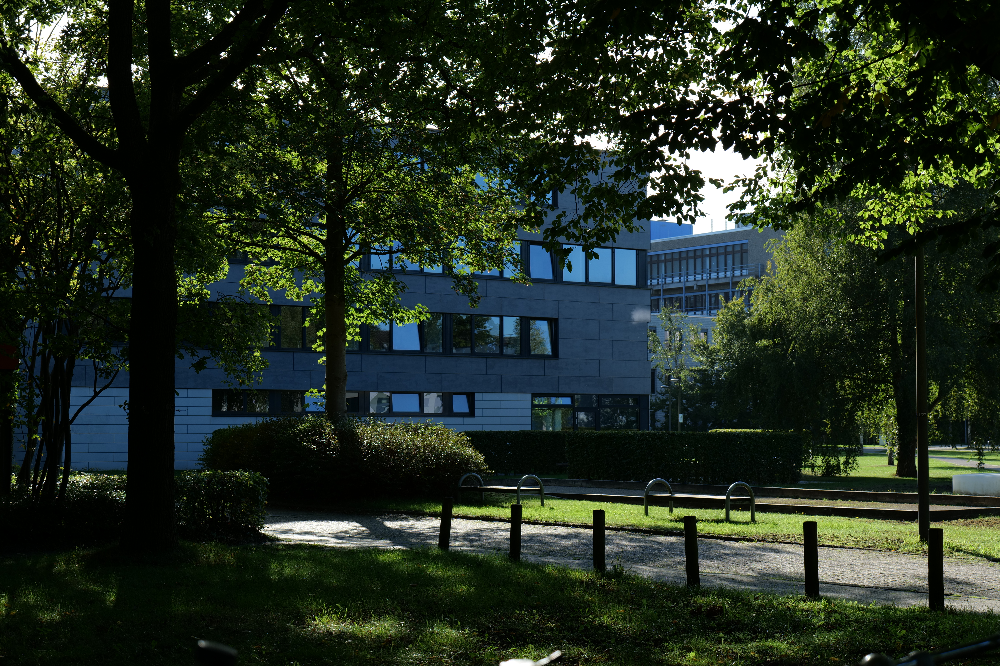
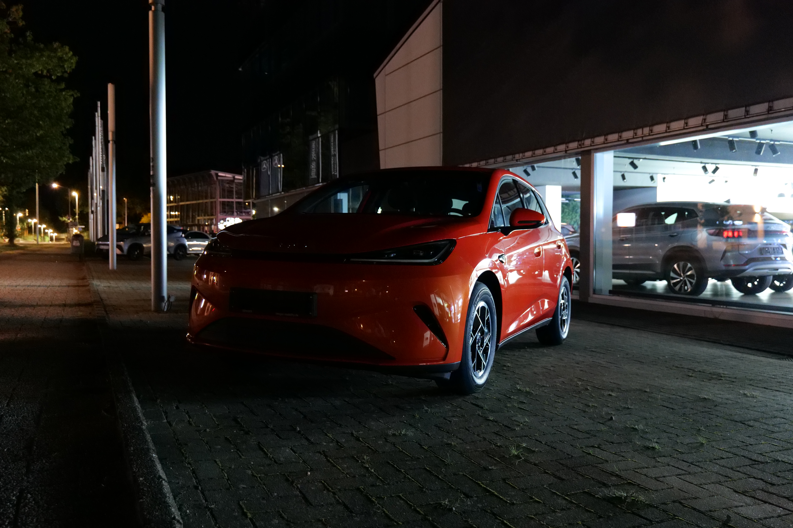

# Overview

Dedicated digital cameras generally don't yet capture images in the Ultra HDR format that is now common in new smartphones, despite the high in-sensor dynamic range. 
This is mostly a research project aimed at automatically applying Ultra HDR image processing to .RW2 files of my Lumix S5 camera to take advantage of developments in high-contrast HDR displays and the accompanying formats,
while also including my philosophy on how HDR technology should be used.

# Comparison

The HDR version on the right will only be shown on compatible display devices, otherwise the SDR rendition is used.
Such devices include recent iPhones, recent Android phones with SDR dimming support and Windows/macOS computers with HDR output.
   
Left: Lumix JPG "Fine" output  
Right: Ultra HDR output
 

 

 

# Explanation

Ultra HDR typically uses an SDR base image with a separate gain map that can be applied to get an HDR image.
This leaves older jpeg decoders with an SDR base image and excellent backwards-compatibility, but at the cost of quality and coding efficiency for the HDR image.
Googles libultrahdr automatically generates Ultra HDR images by accepting an SDR and an HDR rendition of an image.

The two renditions are served by different Darktable styles, which apply different modules to process the image in different ways.
Darktable currently lags behind commercial tools like Lightroom in terms of HDR support.
Images can be exported in Rec.2020 and opened with a compatible viewer to verify any changes, as Darktables viewport currently lacks any HDR display support.

The SDR rendition includes aggressive highlight and shadow tone mapping with local contrast enhancement to compress the wide dynamic range, similar to how modern phones process photos.
The HDR rendition largely omits this to take advantage of the dynamic range afforded by the camera.

The HDR version is not intended to purely be a brighter version, but rather one that was tuned to preserve highlight detail.
Cameras weren't necessarily designed with this in mind, and I strongly recommend shooting with exposure compensation to preserve highlight detail, depending on the contrast in the image.
Shooting with Zebras helps identify situations where you want to expose to the left, such with as bokeh orbs or bright signs.

# How to use

main.py will automatically import any .RW2 images to the Images folder of your OS.
It waits for a USB connection, copies the files and processes them with an -hdr suffix at the output.
Imported files are noted in a hash list to prevent reimporting files that were already deleted from the Images folder.

This currently supports Windows and macOS, and was most recently tested with Darktable 5.6.1.

Currently you have to install the two .dtstyle files to your own Darktable database, as using a .dtstyle file is not supported by darktable.cli.
Darktable probably needs to be configured to the AgX workflow as well.

file_handling.py includes the function to generate the Ultra HDR photo itself. 

Dependencies:
- Darktable
- Libultrahdr build (ultrahdr_app)
- Exiftool

Python dependencies:
- psutil
